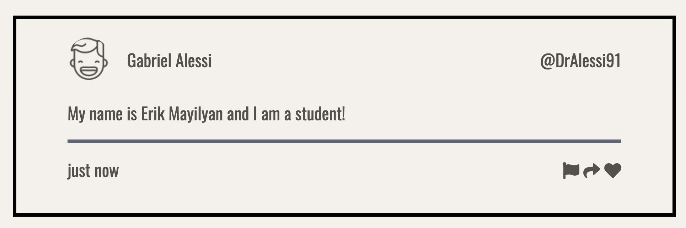
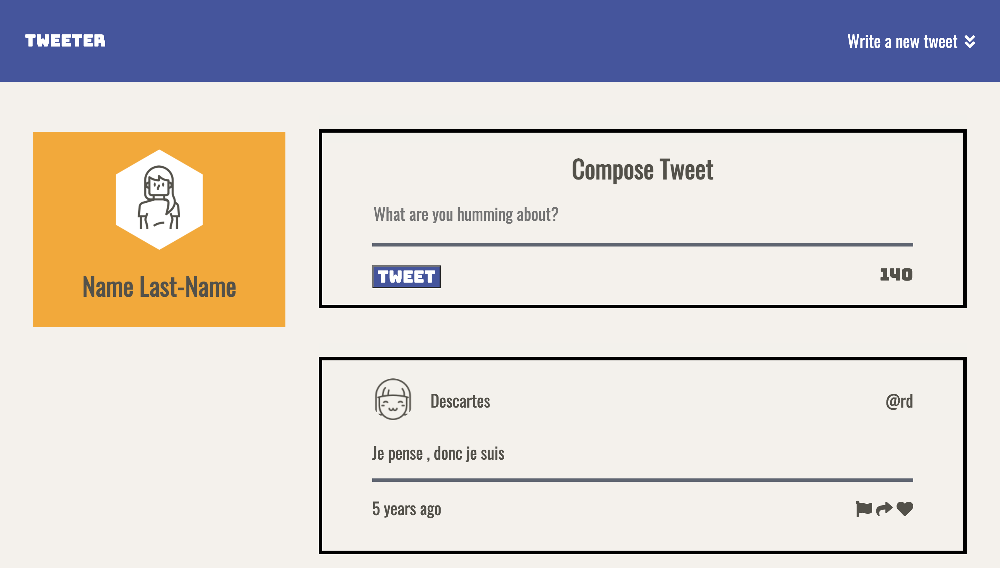

# Tweeter Project

Tweeter Project.

Tweeter Project is a single-page AJAX-based Twitter clone that was created using HTML5, jQuery, and CSS3. On this website, you can post multiple tweets.

## Screenshots

;
;

## Getting Started

1. Fork this repository, then clone your fork of this repository.
2. Install dependencies using the `npm install` command.
3. Start the web server using the `npm run local` command. The app will be served at <http://localhost:8080/>.
4. Go to <http://localhost:8080/> in your browser.

## Dependencies

- Express
- Node 5.10.x or above

